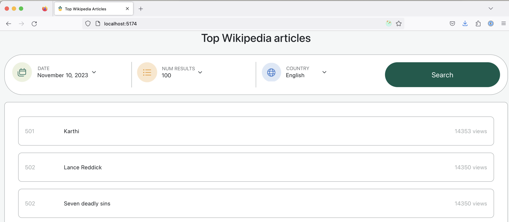

# Grow Therapy Assessment

This is a responsive React + Typescript + Vite + React Bootstrap app that allows users to filter top Wikipedia articles by date and country as well as select the number of results to display per page.



# Running the app

Install dependencies

```
npm install
```

### Running options
- Start the dev server and run the app locally

```
npm run dev
```

- Build a production build and preview it running

```
npm run build
npm run preview
```
_NOTE: The default port is 5174 (e.g. http://localhost:5174/). Drop the url that is provided to you into a browser. The port number could vary if port 5174 is in use._

### Tests
```
npm run test
```

# API

```
fetchMostViewedPages(date: Date, country: string)
```
### Summary
fetchMostViewedPages uses the Wikimedia pageviews API to fetch the top 1000 most viewed Wikipedia pages for a single day (date) and country (country).

### Payload
The fetchMostViewedPages returns a list of article objects with the following interface.
```
{
   article: string,
   rank: number,
   views: number
}
```

### Wikimedia API references
- https://wikitech.wikimedia.org/wiki/Analytics/AQS/Pageviews
- https://wikimedia.org/api/rest_v1/metrics/pageviews/top/en.wikipedia/all-access/2015/10/10